<!-- ══════════════════════════════════════════════════════════ -->
<!--  GUSTRADEV — Fullstack Developer                         -->
<!-- ══════════════════════════════════════════════════════════ -->

<div align="center">
  
</div>

<br/>

<div align="center">

[](https://github.com/gustradev)

</div>

<div align="center">

[](https://github.com/gustradev)&nbsp;
&nbsp;
[](https://github.com/gustradev?tab=repositories)

</div>

<br/>

<br/>

---

<table>
<tr>
<td width="55%" valign="top">

**Hi, I'm Gustra** — a fullstack developer who ships software that is **meant to be used**, not just demoed.

Village digital platforms, BUMDes billing, accounting backends, geospatial dashboards, smart IoT systems — all built to survive real deployment conditions and be understood by real operators.

> *"I don't prototype for demos. I build for the field."*

**Current Focus**

- 🏘️ Village Digital Ecosystems — Civic Tech
- 💰 BUMDes & Billing SaaS Platforms
- 📊 Accounting Systems & ERP Integration
- 🗺️ Geospatial & Public Information Tools
- 🤖 Smart IoT & AI-Assisted Products

</td>
<td width="45%" valign="top">

```yaml
name:        Gustra
role:        Fullstack Developer
domains:     Civic Tech · SaaS · Accounting · IoT
systems:     15+ shipped to production
approach:    ship → iterate → scale

stack:
  frontend:  React · Vite · Mantine · Tailwind
  backend:   NestJS · Fastify · FastAPI · Laravel
  data:      PostgreSQL · MySQL · Redis · Prisma
  infra:     Docker · Linux · Nginx
  iot:       Raspberry Pi · Arduino · MQTT
  ai:        YOLO · Python

values:
  - field-usable UX first
  - backend correctness
  - self-hosted when possible
  - scale only when justified
```

</td>
</tr>
</table>


---

<div align="center">

## 🛠️ Tech Arsenal

<table>
<tr>
<td align="center" width="25%">

**Languages**


</td>
<td align="center" width="25%">

**Frontend**


</td>
<td align="center" width="25%">

**Backend**


</td>
<td align="center" width="25%">

**Infrastructure**


</td>
</tr>
<tr>
<td colspan="4" align="center">


</td>
</tr>
</table>

</div>

---

<div align="center">

## 🏗️ Featured Projects

<sub>Production systems actively running and serving real users</sub>

</div>


<table>
<tr>
<td width="50%" valign="top">

###  Desa Gulingan Digitalisasi

> 🏘️ Integrated village platform with API gateway & modular microservices

**Modules:** User Management, Survey, Absensi, Guest Book, CCTV, SOS, Map Central

     

**[→ View Repository](https://github.com/gustradev/desa-gulingan-digitaliasasi)**

</td>
<td width="50%" valign="top">

###  TPS3R Billing / SIERA

> 💳 Multi-tenant billing platform for village & TPS3R services

**Features:** Invoices, Customer Registry, Payment Flows, Reporting, Audit Architecture

    

**[→ View Repository](https://github.com/gustradev/tps3rBilling)**

</td>
</tr>
<tr>
<td width="50%" valign="top">

###  Accounting System Backend

> 📊 Private accounting backend monorepo with full data pipeline

**Includes:** API, Worker, Shared Packages, Schema Management, Migrations, Seeds

    

**[→ View Repository](https://github.com/gustradev/accounting-system-backend-db)**

</td>
<td width="50%" valign="top">

###  Project Akunting

> 🧾 Custom accounting with React UI, NestJS API & ERPNext backoffice

**Stack Integration:** Frontend ↔ API ↔ ERPNext engine for complete accounting workflow

    

**[→ View Repository](https://github.com/gustradev/project-akunting)**

</td>
</tr>
<tr>
<td width="50%" valign="top">

###  Accounting Sederhana / BUMDes

> 🏦 Simplified accounting for BUMDes operational use cases

**Focus:** Business process mapping, production deployment flow, operational simplicity

  

**[→ View Repository](https://github.com/gustradev/accounting-sederhana)**

</td>
<td width="50%" valign="top">

###  Smart Trashbin Station 🤖

> ♻️ AI-powered smart waste station with edge computing & IoT

**System:** AI Classification, Edge Devices, Dashboard, Real-time Monitoring

    

**[→ View Repository](https://github.com/gustradev/smart-trassch-bin-gtr-stations)**

</td>
</tr>
</table>

<br/>


---

<!-- more projects -->

<details>
<summary><h3>📂 More Projects & Explorations (click to expand)</h3></summary>

<br/>

| Project | Description | Link |
|---------|-------------|------|
| 🏢 **Company Management** | Modular self-hosted company & project management system | [→ Repo](https://github.com/gustradev/company-management) |
| 🚀 **Labda Space Platform** | Product platform for structured web systems | [→ Repo](https://github.com/gustradev/labda-space-platform) |
| 💬 **GVPC** | Chat-oriented application experiments | [→ Repo](https://github.com/gustradev/gvpc) |
| 📒 **Akunting BUMDesa** | Accounting direction for BUMDes use cases | [→ Repo](https://github.com/gustradev/akunting-bumdesa) |
| 🛒 **Pixel Solusindo GPOS** | POS system implementation | [→ Repo](https://github.com/gustradev/pixelsolusindo-gpos) |
| 🎤 **GTR Karaoke** | Niche karaoke product implementation | [→ Repo](https://github.com/gustradev/gtr-karaoke) |

</details>

---

<div align="center">

## 🔄 How I Build

</div>

```
  ╔═══════════════╗     ╔═══════════════╗     ╔═══════════════╗
  ║  📋 Discover  ║────▶║  🧩 Design    ║────▶║  ⚙️ Build     ║
  ║  Real workflow ║     ║  Data + API   ║     ║  Ship to prod ║
  ╚═══════════════╝     ╚═══════════════╝     ╚═══════════════╝
          ▲                                           │
          │     ╔═══════════════╗     ╔═══════════════╗
          ╰─────║  🔁 Iterate   ║◀────║  📦 Deploy    ║
                ║  Refine scope ║     ║  Self-hosted   ║
                ╚═══════════════╝     ╚═══════════════╝
```

<table>
<tr>
<td align="center">🎯<br/><b>Clear Boundaries</b><br/><sub>Well-defined service scope</sub></td>
<td align="center">🛡️<br/><b>Backend First</b><br/><sub>Correctness over speed</sub></td>
<td align="center">👷<br/><b>Field-Ready UX</b><br/><sub>Built for real operators</sub></td>
<td align="center">🏠<br/><b>Self-Hosted</b><br/><sub>Privacy & control</sub></td>
<td align="center">📐<br/><b>Justified Scale</b><br/><sub>Only when needed</sub></td>
</tr>
</table>

---

<div align="center">

## 📈 GitHub Analytics


<br/><br/>


<br/><br/>


</div>

---

<!-- trophies -->

<div align="center">


</div>

---

---

<div align="center">

<sub><b>Built with purpose. Shipped for the field.</b> — <i>I develop because I love what I do.</i></sub>
</div>
